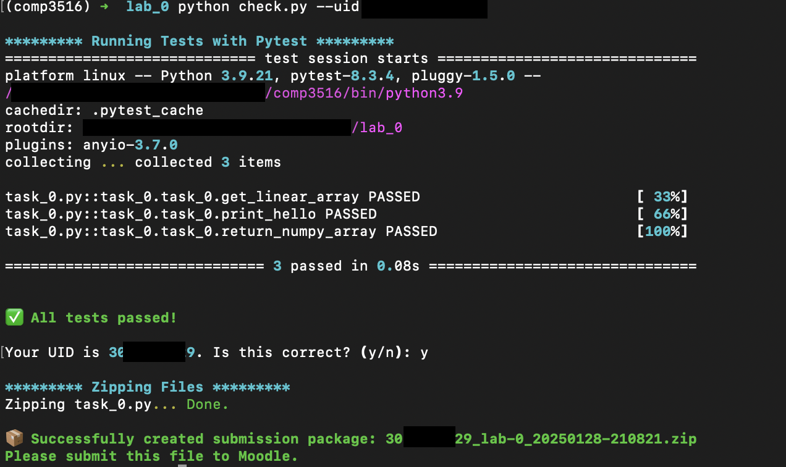

**Auh, there is no submission requirement for this lab!**

**But please read it carefully before you start.**

We take this chance to walk you through the overviews of the labs and help you prepare the necessary environment for the subsequent labs. 

The actual deadlines of the submission for those labs will be adjusted accordingly. 

# Lab 0 -- Beginning!

Welcome to COMP3516@HKU 2025 Spring. This is an undergraduate elective course for senior CS students. This course focuses on fundamental data analytic techniques applicable to IoT (Internet of Things) data. IoT, a domain centered around ubiquitous sensing and computing, finds its applications in diverse fields such as smart homes, healthcare, edge computing, and security. A key aspect of IoT data analysis is basic signal processing, a skill set that may be new to many of you. Students who have completed ELEC3241 and ELEC3244 will find these concepts somewhat familiar, but prior experience is not a necessity. This course is not structured as a rigorous DSP (Digital Signal Processing) class; hence, intricate mathematical derivations will not be a focal point. Instead, our emphasis will be on using coding to analyze data effectively.

Our course structure includes four lab sessions, each comprising comprehensive tutorials and programming tasks. 
Lab 1 introduces common IoT signals, while Labs 2 and 3 delve into fundamental signal data analytics, specifically focusing on FFT (Fast Fourier Transform) and ACF (Auto-Correlation Function). In Lab 4, we'll demonstrate techniques to filter out background noise. Post these labs, you'll be well-equipped to analyze IoT data. 

Regarding assessment, the four labs collectively contribute 20 points to your final grade, each with 5 points.

We are here to guide you through the labs and project, ensuring you're well-prepared for this exciting journey in IoT data analysis.

## Honour Code

Plagiarism is considered a serious disciplinary offense at HKU. To uphold the highest standards of academic honesty, we will employ advanced software tools to scrutinize submitted code for its originality. Should plagiarism be detected, it will result in significant consequences for all involved parties – both the student who plagiarized and the one who provided the work. The initial penalty for such an offense is a zero score for the implicated assignment. Subsequent offenses will incur more severe disciplinary measures, including potential reporting to the faculty. Rest assured, in such events, you will be afforded an opportunity to present your defense.

Despite these stringent measures, we recognize and support the use of Artificial Intelligence Generated Content (AIGC) tools in your academic work. It is imperative, however, that you clearly acknowledge every instance where AIGC tools have been utilized in your submissions. Failing to do so will be considered a violation of the honour code.

## Environment

The labs are all developed in Python. We recommend you to use `conda` to manage your Python environment, which can be achieved by installing `miniconda` or `Anaconda`. 

We prepare a minimal trial to prepare the environment.

1. Create your environment:
```
conda create --name comp3516 python=3.9
```

2. Enter you environment:
```
conda activate comp3516
```

3. Install required packages:
```
pip install -r requirements
```

## Grading and Submission

In each lab, you will see a tutorial (in `.ipynb`) and several programming tasks (in `*.py`). A clear instruction of the programming tasks is located in a `pdf` file. We recommend you to read the tutorial ahead. You can freely reuse the code in our provided tutorial. Afterwards, you will be supposed to implement the programming tasks. In each task, you have to implement several functions in the corresponding file. 

Your grade will depend on the **accuracy** of your implementation in the programming tasks. For part of the tasks, we will use test cases to grade your code. For the other part of the tasks, we will check the output images of your code. It means, if you do not write anything right (to pass the test cases), you will get 0 points for that task. There are no sympathy points in this course.

**Please run `python check.py --uid <YOUR_UID>` before submitting.** This script performs automated tests on the examples provided in the docstrings. Failing these tests indicates potential critical issues in your code. Strive to resolve these problems. After that, it will create a zip file named after your `uid`. Make sure you enter the right `uid`. 

Please be aware that successfully passing the checker is **NOT** a definitive indicator that you have met all test requirements. Generally, the checker is designed to assess **the format** of your output, rather than its content. Therefore, it remains your responsibility to thoroughly verify the reliability and accuracy of your code. 

It's important to NOT change the names of any files, including both the zip file and the program files contained within. Altering file names can lead to grading errors. Ensure that all file names remain as they are to facilitate accurate assessment of your work.

Your submission to **Moodle** should consist solely of the **generated `*.zip` file**. It is your responsibility to double check whether your submitted zip file includes your latest work. 

## Try with `task_0.py`

We provide a simple task for you to try. You can uncomment the code in `task_0.py` and run it. 

```bash
python check.py --uid <YOUR_UID>
```

If you see the following output, you are good to go.



Press `y` to zip your submissions and you will get a `zip` file. Submitting this file directly to Moodle.

**Note:** The submission of lab 0 is **optional**. You can submit it to check whether you can generate the submission file. Yet we will not grade your `lab_0` no matter if you submit or not.


## Asking Questions

Should you have any questions, **posting your queries on Moodle** is compulsory for a couple of reasons. Firstly, articulating your problem in a public forum often helps in organizing your thoughts more clearly, which can be instrumental in finding a solution. Secondly, while lecturers and TAs may not always be available to address your queries immediately, your fellow students who can assist are greatly appreciated.

Empirically, it has been observed that most problems you might encounter have already been resolved online. Therefore, if you face any issue, it's advisable to **first search the web** for solutions. This approach not only saves time but also encourages good practices like consulting manuals/documentation and conducting thorough Google searches for your specific problem.

You are encouraged to share and discuss your thoughts or doubts with your peers. However, it's important to draw a clear line when it comes to sharing answers or code. Any exchange of answers or code is strictly prohibited and, if identified, will be treated as a case of plagiarism. 

**All** the problems should be posted to **Moodle**. Failing to do so will not get any reply from the TA.

**All** the problems should be posted to **Moodle**. Failing to do so will not get any reply from the TA.

**All** the problems should be posted to **Moodle**. Failing to do so will not get any reply from the TA.

## Email

I have a bunch of emails everyday. To make sure I can reply to your email in time, please follow the following rules. 

My working email is [shenglyu@connect.hku.hk](mailto:shenglyu@connect.hku.hk). Please use this email for any communication. Other emails will not be replied.

All the emails should use a subject starting with [COMP3516]. For example, the subject of an email can be
```
[COMP3516] Questions about the grading of Lab 1
```
I have automatic filtering rules to filter out emails without this subject. Late replies may happen if you do not follow this rule.

I use email to process the following types of requests:

- **Personal matters**: If you have a personal issue that you would like to discuss with me, please email me. Questions regarding the course are not considered personal matters and should be posted on Moodle.

- **Grading matters**: If you believe there is an error in your grading, please email me with a clear explanation of the issue. Please note that I will not entertain any requests for regrading after one week of the release of the grades.

- **Accommodation requests**: If you have a documented accommodation request, please email me with the relevant documentation.

- **Rescheduling office hours**: If you are unable to attend office hours due to a valid reason, please email me to reschedule.

- **Feedback**: If you have any feedback on the course, please email me. I am always looking for ways to improve the course.

TA will **NOT** answer any email regarding your questions about the lab. Please post your questions on Moodle.

TA will **NOT** reply to any email regarding to the exam content. 

Do **NOT** set any flags on your email. I will not read any email with a flag set.

I guarantee that I will reply to your email within **96 hours**. If you do not receive a reply within 96 hours, please resend the email. 

Refrain from sending multiple emails on the same topic in different email threads within the 96-hour period. If you do so, your email will be marked as spam. If your email is under the same subject (thread), it will not be regarded as multiple emails.

## Office Hour

The office hour of TA is

- Thur 12:30 PM - 13:30 PM (f2f)
- Mon 9:30 AM - 10:30 AM (Online)

I provide F2F office hours on Thursday and online office hours on Monday. 

Office hours are **strictly** by appointment. All the appointments mush submit through [form](https://hku.au1.qualtrics.com/jfe/form/SV_bmudu4j6QIUTWOG).
  
Please note that these times may be subject to change. It means that I can adjust the time per request. Appointments are crucial; unscheduled visits are considered inappropriate and may not be accommodated. Time slots are allocated based on the content you provide, and you can expect a reply confirming your appointment within **one week**.

You will receive an email once your form is submitted. Please refrain from reaching out to them during this time (one week).

My office is located in room HW101M, within the HW building, 1st floor. I may reserve other conference rooms when needed. 

Under **NO** circumstances should you use WhatsApp to contact me, because it is rude and unprofessional. And I will not reply to any message on WhatsApp.

Direct assistance with coding or debugging is NOT provided in office hours.

Actually, the time is valuable for both of us. And I can guranatee that your grades will not be affected by the number of times you visit me.

I believe you'll know it when you need to use the office hour.

At last, allow me to express my warmest wishes for the LNY. May the Year of the Snake bring you good health, happiness, and prosperity.

**Hope you have an enjoyable great journey in this course!**


