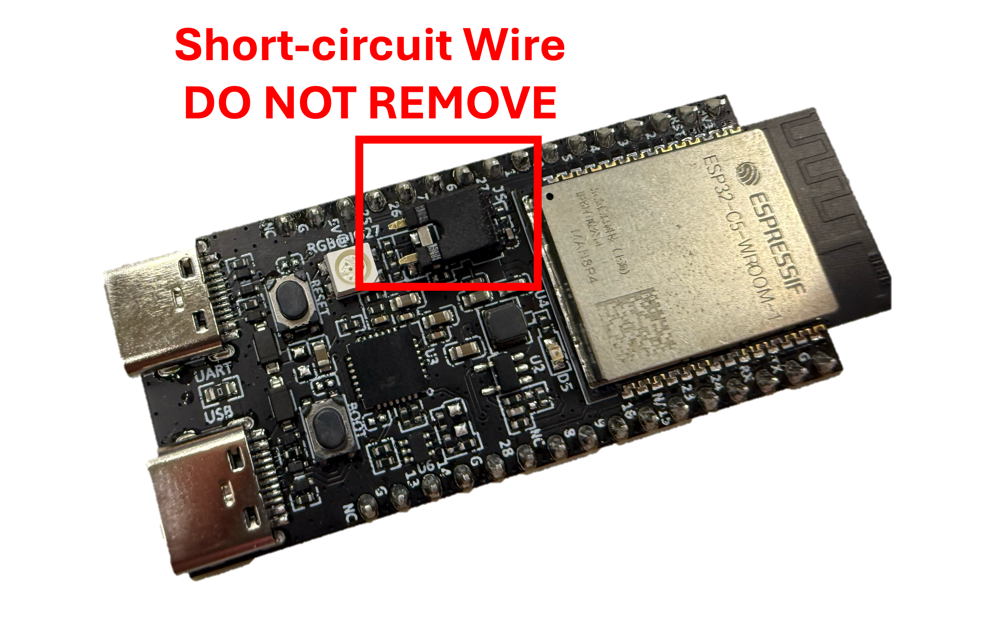
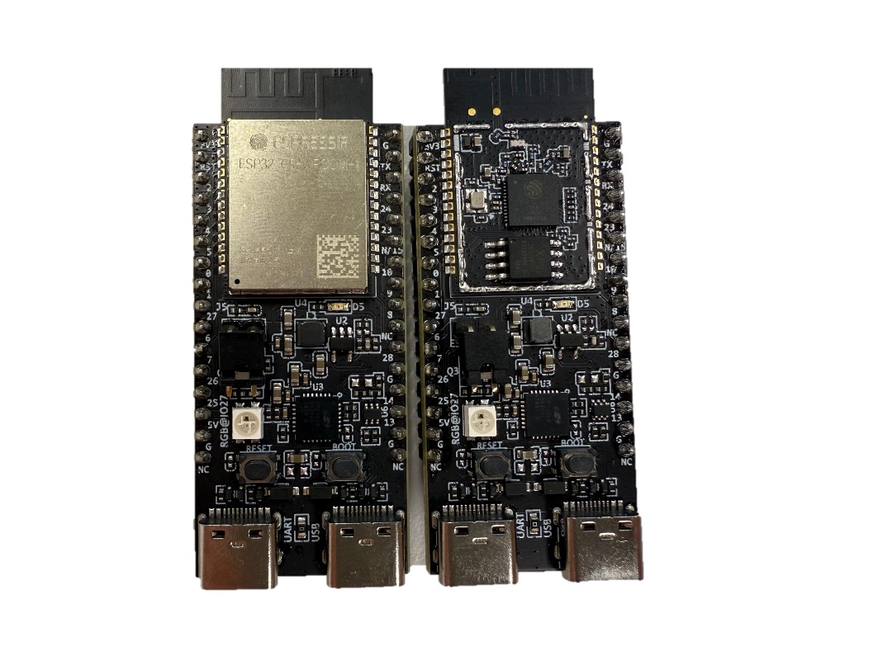
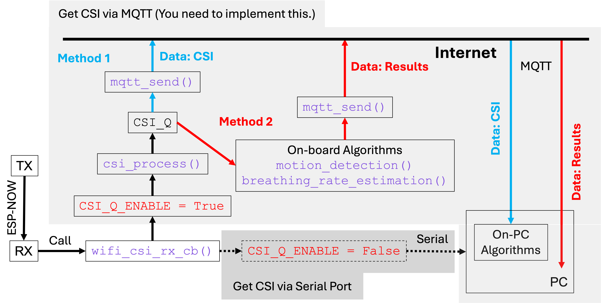

---
title: "Group Project"
author: COMP3516@HKU
date: "Due: 2025-04-24"
keywords: 
---

# Group Project

We have explored various methods and conducted experiments on extracting vital signs using wireless modalities through lectures and labs. Now, let's dive in and get hands-on with the real embedded system.
In this task, you will build an end-to-end Wi-Fi based breathing rate and motion detection system. 
You will have the chance to record the real CSI data and exploit it for motion detection and breathing rate estimation. You will also have the chance to transmit the data to a PC via MQTT and visualize the results.

The typology and scenario of the experiments is depicted as follows:


In this project, you will be required to complete six tasks:

- **Task 0: Prepare your ESP32**

  Setup your hardware and software environment.

- **Task 1: CSI Collection (10 pts)**
    
    Successfully send and receive CSI data between the transmitter (TX) and receiver (RX).
    
- **Task 2: Data Processing (50 pts)**
    
    Design an algorithm to process the CSI data you collected.
    
    - **Task 2.1: Motion Detection (20 of 50 pts)**
        
        Implement an algorithm to detect motion using CSI data.
        
    - **Task 2.2: Breathing Estimation (30 of 50 pts)**
        
        Develop an algorithm to monitor and detect breathing rates from CSI data.
        
- **Task 3: Data Transmission (20 pts)**
    
    Transmit data from the RX to your PC via the **MQTT** protocol.
    
- **Task 4: Data Visualization (10 pts)**
    
    Develop an end-to-end system that visualizes your results.
    
- **Task 5: Report Writing (10 pts)**
    
    Write a report to show your results and explain your algorithm design using provided template.
    

---

## Grading Rubric

| Features                            | Grades (point) | Details                                                                                                                                                                                                                                                             |
| ----------------------------------- | -------------- | ------------------------------------------------------------------------------------------------------------------------------------------------------------------------------------------------------------------------------------------------------------------- |
| Task 1: CSI Collection              | 10             | -                                                                                                                                                                                                                                                                   |
| Task 2.1: Motion Detection          | 20             | Performance: 30% <br> Method: 60% <br> Real-time: 10% <br> On-board: 10% bonus                                                                                                                                                                                      |
| Task 2.2: Breathing Rate Estimation | 30             | Performance: 30% <br> Method: 60% <br> Real-time: 10% <br> On-board: 10% bonus                                                                                                                                                                                      |
| Task 3: Data Transmission           | 20             | Use MQTT to transmit the data to your PC. The data can be the results of your algorithm or the raw CSI data, or any other information you want to transmit.                                                                                                         |
| Task 4: Data Visualization          | 10             | Build an end-to-end system that visualizes your results. This can be a Web App, a desktop application or a mobile app. Try to visualize your results, including the intermediate results of your algorithm. It resembles a dashboard for the user to interact with. |
| Task 5: Technical Report            | 10             | -                                                                                                                                                                                                                                                                   |
| **Total**                           | **100**        | Contribution statements will be considered in grading.                                                                                                                                                                                                              |
| *Live Demo*                         | 5              | *Bonus* on your total scores                                                                                                                                                                                                                                        |

> You are encouraged to implement your motion detection and breathing rate estimation algorithm on-board. Doing so will earn 10% bonus points for task 2.

> If you choose to implement the algorithm on your laptops (e.g. developing Python codes), you are encouraged to work on Task 3 before Task 2, therefore you can acquire the CSI data that you will need for Task 2.

> Note that the CSI transmission can be slow, based on your implementations. It will affect the real-time performance of your algorithm. 


---

## Prerequisite on ESP32C5

You are highly recommended to refer to the following websites for more detail:

|      Content      |                                                    Source                                                    | Recommendation | Notes                                                                                                                                              |
| :---------------: | :----------------------------------------------------------------------------------------------------------: | :------------: | -------------------------------------------------------------------------------------------------------------------------------------------------- |
|   ESP-IDF Tool    |                                [GitHub](https://github.com/espressif/esp-idf)                                |      ***       | Official documentation for the ESP-IDF toolchain. Refer to this resource for guidance on compilation, flashing, and installation issues.           |
| ESP-NOW Protocol  | [Document](https://docs.espressif.com/projects/esp-idf/en/latest/esp32c5/api-reference/network/esp_now.html) |      ***       | Detailed explanation of the ESP-NOW protocol. Use this document to understand the differences between ESP-NOW and standard Wi-Fi protocols.        |
| ESP32-C5 Document |       [Document](https://docs.espressif.com/projects/esp-idf/en/latest/esp32c5/get-started/index.html)       |      ***       | Comprehensive documentation for ESP32-C5, featuring tutorials and troubleshooting guides to resolve common issues and bugs.                        |
|      ESP-DSP      |                                [GitHub](https://github.com/espressif/esp-dsp)                                |       **       | Official repository for basic signal processing methods (e.g., FFT, filters). Integrated with the latest ESP-IDF Tool; add dependencies as needed. |
| VSC IDF Extension |                       [GitHub](https://github.com/espressif/vscode-esp-idf-extension)                        |       *        | Official VS Code extension for ESP-IDF. Download this extension to streamline development directly within Visual Studio Code.                      |


### Hardware Requirements

- **Two ESP32-C5 Boards**: One board acts as a transmitter, and the other as a receiver.
- **Placement Guidelines**: Ensure the two boards are placed at least **1 meter apart** for effective CSI sensing.

### Hardware Setup

Please refer to the [ESP32C5 Start-up Tutorial](./esp_tutorial.md) for more details.

Make sure you have installed the development environment and flashed the firmware onto the ESP32-C5 boards. Below are some additional notes:

1. Each ESP32-C5 board has two serial ports for flashing and data transmission: **UART** and **USB**. The assigned serial ports may vary depending on the PC used.
2. When flashing the board, if one serial port is unavailable, try using the other. Additionally, run `idf.py clean` or `idf.py fullclean` before the next flash attempt to ensure a clean build.
3. Do not change or mistake the bitrate when flashing the sender and receiver board:
    - **Sender board:** 115200 bps
    - **Receiver board:** 921600 bps
4. Ensure that your **ESP-IDF toolchain** is properly set up and can successfully connect to the board. By default, the sender board only needs to be flashed once; it will then automatically transmit ESP-NOW packets when powered by a battery.
5. If the compiled binary file exceeds the default flash memory limit, use `idf.py menuconfig` to increase the *Flash size* (default is 2 MB) under *Serial Flasher Config*.
    
    
    
6. Carefully check the **short-circuit wire** on the board and ensure it remains in place. Do not remove it.
    
    
    
7. ESP32-C5 has two different layouts; however, they function the same for all applications.
    
    
    
8. When flashing, please avoid the register error, which is harmful for the hardware.


### Software Setup

In the traditional Wi-Fi CSI sensing, the transmitter typically operates in **station mode**, while the receiver functions in **monitor mode**, establishing a direct link for wireless sensing. However, **Espressif** has introduced **ESP-NOW**, a connectionless Wi-Fi communication protocol that enables data transmission without requiring a traditional Wi-Fi connection. In this approach, both the transmitter and receiver remain in **station mode**, deviating from conventional methods and offering a more flexible solution for CSI sensing. 

### Flashing the Firmware

Run the following commands to flash the firmware onto the ESP32-C5 boards:

```bash
# Flashing the transmitter
cd csi_send
idf.py --preview set-target esp32c5
idf.py build flash monitor -b 115200 -p /your/port

# Flashing the receiver
cd csi_recv
idf.py --preview set-target esp32c5
idf.py build flash monitor -b 921600 -p /your/port
```

The results can be seen as follows:


### CSI Data Format

A single row of raw CSI data includes metadata and CSI values. Example:

```
type,seq,mac,rssi,rate,noise_floor,fft_gain,
agc_gain,channel,local_timestamp,sig_len,rx_state,len,first_word,
data CSI_DATA,0,1a:00:00:00:00:00,
-55,11,159,19,40,8,837230,44,0,234,0,
"[-5,-28, ...]"
```

- **Metadata Fields**: Include `type`, `seq` , `mac`, `rssi`, `rate`, `noise_floor`, `len`, `first_word` , etc.
- **CSI Data Array**: Stored as an array of values in **[imaginary, real]** format for each subcarrier.

In the benchmark dataset, the CSI data will be stored as CSV files, which are structured as follows:

- **Headers**: Each CSV file contains multiple headers, with the last column representing the CSI values.
- **Data Shape**: The CSI data is stored in a **time (row) × subcarrier (last column)** format, with a sampling rate of 100 Hz.

<!-- ### Communication Protocol Configuration

Key ESP-NOW Wi-Fi communication and CSI parameters are defined in `main.c`. Ensure the following settings are identical in both `csi_send` and `csi_recv` projects:

```c
#define CONFIG_LESS_INTERFERENCE_CHANNEL    40
#define CONFIG_WIFI_BAND_MODE               WIFI_BAND_MODE_5G_ONLY
#define CONFIG_WIFI_2G_BANDWIDTHS           WIFI_BW_HT20
#define CONFIG_WIFI_5G_BANDWIDTHS           WIFI_BW_HT20
#define CONFIG_WIFI_2G_PROTOCOL             WIFI_PROTOCOL_11N
#define CONFIG_WIFI_5G_PROTOCOL             WIFI_PROTOCOL_11N
#define CONFIG_ESP_NOW_PHYMODE              WIFI_PHY_MODE_HT20
#define CONFIG_ESP_NOW_RATE                 WIFI_PHY_RATE_MCS0_LGI
```

- Receiver-Specific Configuration
    
    ```c
    #define CONFIG_FORCE_GAIN 1   // Enable fixed gain mode (1 = enabled)
    ```
    
- Transmitter-Specific Configuration
    
    ```c
    #define CONFIG_SEND_FREQUENCY 80   // CSI packet transmission frequency
    ``` -->

### MQTT
The following materials can be useful to setup MQTT service for the ESP32C5 device:

1. On Host PC (broker):  Create an MQTT broker service using [Mosquitto](https://mosquitto.org/).
    - [Download & install](https://mosquitto.org/download/) Mosquitto
    - Installation tutorial ([Windows](https://www.youtube.com/watch?v=4ZEPPQLY5o4), [Mac](https://www.youtube.com/watch?v=AD1YvjmRiR4&t=343s))
    - Alternatively, you can use [EMQX](https://www.emqx.com/en/downloads-and-install/broker) as the MQTT broker service. 
2. Establish Pulisher on ESP32-C5
   - Refer to this file: https://github.com/espressif/esp-idf/blob/master/examples/protocols/mqtt/tcp/main/app_main.c  
3. On Host PC (subscriber): Run MQTT client python [Paho-MQTT](https://github.com/eclipse/paho.mqtt.python#installation). 
    - YouTube: [MQTT Beginner Guide with Python](https://www.youtube.com/watch?v=kuyCd53AOtg)
    - Most languages have MQTT client libraries, including Java, Flutter, JavaScript, etc.
---

## Starter Code and Benchmark Dataset

You will be provided with the following materials:

- One package of basic source code
- Benchmark dataset
  

### 1. Structure of the Starter Code

> You are not necessarily required to use the starter code. You can implement your own code as long as it works.

We provide a basic package of source code, located in the `esp32c5/csi_send` and `esp32c5/csi_recv` folders. Both subprojects share a similar folder structure, including `CMakeLists.txt`, `main/`, `main/app_main.c`, `main/idf_component.yml`, and more.

#### 1.1 Implementing Required Tasks


`main/app_main.c` for both the `csi_send` and `csi_recv` folders is the main file that you need to work on. To facilitate your implementation, we have created some code blocks that you can use as a starting point. Each block starts and ends with the comment: 

```c
// YOUR CODE HERE
// END OF YOUR CODE
```

Besides that, you can also add other functions at the proper position **freely** if necessary. You can also modify the function signatures if necessary. 

#### 1.2 Compilation and Dependencies Management

In addition to `main/app_main.c`, both the manifest file `main/idf_component.yml` and the CMake file `main/CMakeLists.txt` play crucial roles in the compilation process:

- **`main/CMakeLists.txt`**: Manages the technical aspects of building the component.
- **`main/idf_component.yml`**: Provides metadata and dependency information for component management.

To include additional components (such as `esp-dsp`, the digital signal processing library), modify the `main/idf_component.yml` file following YAML syntax ([documentation](https://docs.espressif.com/projects/idf-component-manager/en/latest/reference/manifest_file.html)). 

Additionally, update the `idf_component_register` function in `main/CMakeLists.txt` to ensure proper integration of the new components.

#### 1.3 Diagram of `TX app_main.c`

The figure below illustrates the implementation diagram for the TX `app_main.c` file. A key parameter, `CSI_Q_ENABLE`, controls whether CSI data is stored in a buffer `CSI_Q` or sent via a serial port.

- When **`CSI_Q_ENABLE = True`**, the received CSI data is stored in a queue buffer `CSI_Q` and updated using a **First-In-First-Out (FIFO)** mechanism by `csi_process()`. The buffered data can then be sent via MQTT using `mqtt_send()`, allowing two methods of data transmission:
  - **Method 1 (Blue Path - Data: CSI)**: CSI data is sent directly to the PC via MQTT, where on-PC algorithms can be implemented.
  - **Method 2 (Red Path - Data: Results)**: On-board algorithms such as `motion_detection()` and `breathing_rate_estimation()` process the buffered CSI data, and the results are sent to the PC via MQTT.

- When **`CSI_Q_ENABLE = False`**, CSI data is sent through a serial port instead. This setting is useful for verifying whether TX has been successfully flashed and is collecting data. However, it must be set to `True` for other tasks.

- The function `wifi_csi_rx_cb()` handles the reception of CSI data. Based on `CSI_Q_ENABLE`, it either processes the data in a buffer for onboard calculation or outputs it via serial.

- You need to properly implement `csi_process()` to store and analyze CSI data and modify the `mqtt_send()` function to transmit either raw CSI data or processed results.

  


### 2. Benchmark Dataset

We provide two benchmark datasets, each designed to facilitate the evaluation of different wireless sensing tasks: motion detection and breathing rate estimation. These datasets contain Channel State Information (CSI) recordings, which serve as the core data source for developing and benchmarking CSI-based sensing algorithms.

The dataset structure is as follows:

```bash
benchmark
├── breathing_rate
│   ├── evaluation
│   └── test
└── motion_detection
    ├── evaluation_motion
    ├── evaluation_static
    └── test
```

Each dataset is split into two parts:

- **Evaluation Set**: Labeled data used to benchmark algorithm performance.
- **Test Set**: Unlabeled data reserved for performance validation, contributing 20% of the overall task assessment.

#### 2.1 Motion Detection Dataset

The benchmark dataset for CSI-based motion detection is stored in the `benchmark/motion_detection/evaluation_motion` and `benchmark/motion_detection/evaluation_static` directories. Each folder contains CSI files labeled according to their respective categories, representing either **motion** or **static** states.

1. The evaluation dataset comprises CSI files categorized into motion and static states, forming a binary classification problem.

2. Our benchmark method achieves **100% accuracy** on the labeled dataset (`evaluation_motion/` and `evaluation_static/`), effectively distinguishing between motion and static states. The accuracy can be formulated as:
    
    $$
    \alpha = \frac{N_{\text{correct}}}{N} \times 100\%,
    $$
    
    where $N_{\text{correct}}$ and $N$ represent the number of correct predictions and the total number of samples in the `test` folder, respectively.
    
3. The CSI files in `benchmark/motion_detection/evaluation_motion` and `benchmark/motion_detection/evaluation_static` are strictly for evaluating motion detection algorithms. Additionally, unlabeled CSI files in `benchmark/motion_detection/test` will be used for performance assessment, contributing **20% of the task**.

#### 2.2 Breathing Rate Dataset

The benchmark dataset used for CSI-based breathing rate evaluation is located in the `benchmark/breathing_rate/evaluation` folder. It consists of CSI files paired with their respective ground truth files, where the ground truth BPM values are obtained using a breathing belt. Each BPM value is computed from 15-second intervals and updated approximately every second via queue mechanism (FIFO).

1. The evaluation dataset comprises the following CSI files and their corresponding ground truth files:
    
    
    | CSI File               | Ground Truth File      |
    | ---------------------- | ---------------------- |
    | CSI20250227_193124.csv | gt_20250227_193124.csv |
    | CSI20250227_191018.csv | gt_20250227_191018.csv |

2. The benchmark employs **Mean Absolute Error (MAE)** as the primary evaluation metric. MAE quantifies the absolute difference between the estimated and actual BPM values, providing an accurate measure of model performance. The formula of MAE can be expressed as:
    $$
    e_{\text{MAE}} = \frac{1}{N} \sum_{i=1}^{N} |BPM_{\text{pred},i} - BPM_{\text{gt},i}|,
    $$
    where $BPM_{\text{pred}, i}$ and $BPM_{\text{gt}, i}$ represent the predicted and ground truth BPM values for the $i$-th sample, respectively.
    
3. Our baseline approach yields a **median MAE $\tilde{e}_{\text{MAE}}$ of 0.94 BPM**.
   
4. The evaluation files under `benchmark/breathing_rate/evaluation` is only employed to evaluate your algorithm. The CSI files without labels under `benchmark/breathing_rate/test` will be considered as the performance evaluation marks, contributing **20% of the task**.

---

## Evaluations

### Task 1: CSI Collection (10 points)

Before starting this task, ensure that all necessary toolchains are installed. You can refer to the startup tutorial on Moodle for guidance. In this task, you will build and flash the firmware onto the board to verify that the transmitter successfully transmits and the receiver successfully receives the CSI data.

**Criteria**:

- You should include screenshots in their report demonstrating the successful build and flash process for both TX and RX.
- The `build` folders under `csi_send` and `csi_recv` must exist and contain files (i.e., they should not be empty).

### Task 2: Motion Detection (20 points)

Implement motion detection using CSI data to identify movement within the environment. The expected output is a boolean value: 1 for motion detected and 0 for no motion. The evaluation metric is accuracy.

**Criteria**:

- You should provide an algorithm for motion detection.
- You should include a description of the algorithm's implementation in the technical report.
- You should fill in your benchmark results in the technical report.
- If you implement the algorithm on-board, state it **explicitly** in the technical report.
- To evaluate the real-time performance, you should include a video demonstrating the functionality. You can include several scenarios in the video, such as moving around, static, etc.


### Task 3: Breathing Rate Estimation (30 points)

Develop an algorithm to estimate and monitor an individual's breathing rate using CSI data. The expected output is an **integer** in beats per minute (BPM), rounded to the nearest whole number. The evaluation metric is the median mean absolute error (MAE).

**Criteria**:

- You should provide an algorithm for breathing rate estimation.
- You should include a description of the algorithm's implementation in the technical report.
- You should fill in your benchmark results in the technical report.
- If you implement the algorithm on-board, state it **explicitly** in the technical report.
- To evaluate the real-time performance, you should include a video demonstrating the functionality. The video should present the student ID cards at the beginning for verification. You can include several scenarios in the video.
- In your report, for each breathing rate test file, you should include a graph that shows how the measured breathing rate changes over time. Additionally, for each file, provide the average breathing rate (in bpm).

### Task 4: Data Transmission (20 points)

Set up the **Message Queuing Telemetry Transport (MQTT)** protocol to transmit data from the ESP32-C5 to a host device (e.g. laptop).

**Criteria**:

- You should successfully transmit the estimated breathing rate and/or raw CSI data via MQTT.

- You should include screenshots or logs demonstrating the MQTT message flow in your technical report.

- To earn this grade, if you are unable to implement the algorithms, you must transmit some alternative information (e.g., teammates' UIDs and CSI for offline computation) via MQTT. Partial points will be awarded for this approach.

### Task 5: Data Visualization (10 points)

Develop an end-to-end system that visualizes your results. This can be a Web App, a desktop application or a mobile app. Try to visualize your results, including the intermediate results of your algorithm. It resembles a dashboard for the user to interact with.


**Criteria**:

- You should include screenshots or logs demonstrating the data visualization in your technical report.
- You should include your designs of the data visualization in your technical report.
    - Think from the user's perspective, what they want to see and what they want to do.
- It is highly encouraged to include the video in your submission.

---

## Submission

Each team needs only one member to submit the **`.zip` file** to Moodle. The file should contain:

1. **Technical Report (`report.pdf`)**
    
    The technical report must clearly document your implementation and performance analysis. The maximum length is **4 pages**. A standard LaTeX template is provided (`report_template.zip`). 

    You should follow the template and fill in your results and team information. Missing information will result in a penalty.
    
    You can include the bibliographic information and appendices in your report. This will be excluded from the page count. Yet you should ensure that the report (4-page) is self-contained and does not require additional information from the reader.

    Make sure you have completed the contribution statement and checklist.

    Proper citations and references would greatly enhance your report. 

    You should write like a technical paper, including the abstract, introduction, method, evaluations and conclusions. 

    
    **Only PDF submissions will be accepted.**
    
2. **Implementation**
    
    The submission must specify the location of the algorithm implementations. All **code** and the **`build` folder** for both **TX and RX** must be included.

    You are encouraged to include a `README.md` file to help the TA to verify your code. You should make sure that the TA can successfully compile and run your code.

    Before the end of this course, you are not allowed to push your code to the public repository, including GitHub, GitLab, etc. 


3. **Video (Optional)**

    You can choose to include the video in your submission. If the video is big, you can host it on YouTube and provide the link in your technical report. Note that you should present the student ID cards of the groups at the beginning for verification. You can include some water-mark in the video as well.

    The maximum length of the video is **3 minutes**. You should include your technical approaches, the real-time performances, and your visualization results.

    If you choose not to submit the video, the real-time performance will not be considered and you will not get the points of the real-time performance. 

**Name your zip file as `gp_<your_team_name_without_space>.zip`.**

---

## In-Class Demo and Competition

We plan to hold an **in-class demo and competition** at the end of the semester. The group project should be designed with this objective in mind. **Finalists may receive up to 5 bonus points in your final score** for a live in-class demo, which will be graded as follows:

1. Participation in the live demo session. (1 pt)

2. The system can successfully run and function for motion detection (regardless of the performance). (1 pt)

3. The system can further work for breathing estimation. (1 pt)

4. The system achieves accurate and robust performance. (1 pt)

5. The overall very best demo(s). (1pt)

> Your score will be calculated as 30% of the final score. However, the 5 bonus points will be added to your final score directly. 


## Use of GenAI

It is highly encouraged to use GenAI to help you complete the project. Basically, the GenAI can help you establish the scaffold of the code, and you can ask whatever problems you have about the project.

Normally, the GenAI writes better code than you. However, the tricky part is, you are processing the "real-world" data, and the data is always noisy, or sometimes even not working. However, based on the knowledge you have learnt and the skills you have gained in the lectures and labs, it should not be a big problem for you. Come up with your own ideas and implement them.

The group project is quite flexible and open-ended. We look forward to seeing your creativity and innovation.

Do not forget to mention the use of GenAI in your technical report, including sharing your prompts, and the results you have achieved. Doing so will not only help you get a better grade, but also help you improve your skills in using GenAI.
